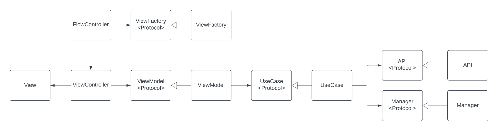

# Nike App Test Project

## Instructions
- Download and run the app, no 3rd party libs. 
- Install on a real device, simulator will have issues, it will work only for the first time, but later it will not. The reason is that the web site is failing to establish a connection or complete a handshake, especially after the first run. It's specific to the Simulator and often occurs with servers using Cloudflare or HTTP/3 (like fakestoreapi.com does).

## Features
- **Universal UI**: Supports portrait & landscape, light & dark modes.
- **Two Tabs**: 
  - **PRODUCTS**: Fetches data from fakestoreapi.com.
  - **CART**: Displays items (newest first), swipe‑to‑delete, shows item count & total price.
- **Product Detail**: Tap Product to view details, add/remove to cart. It can also be accessed from the Cart Item tap. 
- **Checkout**: Flaky API (`https://httpbin.org/delay/3`). Works most of the timet and on failure, shows an error alert and allows retry.
- **Swipe to delete**: In cart list there is also swipe to delete feature for every item and we can see number of items and total price before checkout. 

## Architecture:
- MVVM and CLEAN architecture used
- Folder structure is separated into UI and ENGINE (view and business domain).
- In UI we have Views, ViewModels separated into logical units while in ENGINE we have UseCases, Comms, APIs, Utils, Factories, Data

#### **Components**

The application uses a common design pattern throughout. This is based on Clean Architecture Principles. Each “layer” of the architecture is separated by Protocols following the Interface Segregation Principle (ISP) and Dependency Inversion principle (DIP). This allows dependencies to be injected during object creation and test mocks to be created during unit testing to allow the independent testing of components.

Each View in the application has the structure outlined below (black arrows indicate ownership, white arrows indicate inheritance), see the image:

#### **ViewModel**

Calls UseCase methods to do work and updates Views. Events are communicated asynchronously with the View using Swift Concurrency. A ViewModel can utilise the functionality provided by a number of UseCases to achieve its goals.

#### **UseCase**

Encapsulates the Business Logic of the application. UseCases typically use APIs and Managers to get resources, convert the resources into core Data objects and return those to the caller. UseCases utilise Async Await (Swift Concurrency) to handle data communication and asynchronous processes. A UseCase can combine the functionality provided by a number of other UseCases and/or Manager and API classes to achieve its goals. Consolidates errors to a set of UseCase specific errors.\

#### **API**

Generates a Comms Request Object and uses the CommsSession to send this request and parse the response. Parses JSON responses to DTO objects or generates networking errors. APIs utilise Swift Concurrency to handle asynchronous operations and error propagation.

#### **Data / DTO objects**

APIs handle DTO objects which are defined by the web APIs. These typically use non-standard naming conventions such as underscores to separate words (`address_line_1`). DTOs are mapped to application specific Data objects for use by the application beyond the UseCase boundary.

## Error Handling strategy

Data is passed from API -> UseCase -> ViewModel via do try catch. Errors are consolidated at each level and passed along the chain. At the ViewModel level these errors are converted to alerts and the View handles the rendering of that.

For example, an API error (E.g. ProductAPIError) is converted by the UseCase into a specific UseCaseError (ProductUseCaseError.invalidProductIdError). This reduces the error set to a known set for this particular UseCase. The UseCase passes this UseCaseError to the ViewModel which then handles and displays to the user depending on the Error and the UX of the screen.

## Test Strategy

Several test classes have been made and in general the strategy is:

* **Unit testing**: Unit tests have been written as a show case what can be done

* Target code coverage would be implemented in:
    * Use cases
    * View models
    * Data models

* Target code coverage exclusions would be in :
    UI, Manager and Utility components where OS level code and API calls are integrated such as:
    * Factories
    * Comms
* **UI testing**: XCUITest can be used for flows and Snapshot testing framework for Images. In this case I did not implement them due to the lack of time. 
